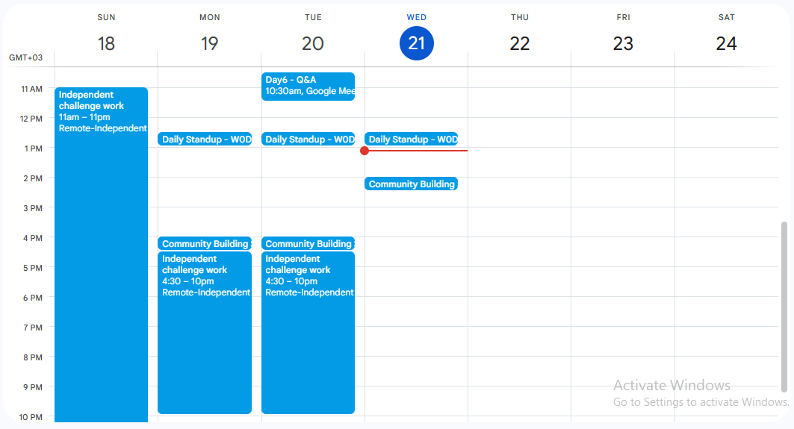

# Week 0 – Time Management
**Full Name:** Haileamlak Belachew  
**Challenge Name:** Week 0 – Time Management  

---

## 1. Task Prioritization

### 🟥 High Priority
| Task | Reason |
|------|--------|
| ✅ Attend daily stand-up (9:30 AM) | Time-bound and non-negotiable team sync critical for daily alignment. |
| ✅ Fix client issue (overdue) | Client has waited a week; ignoring it affects company reliability. |
| ✅ Submit management report | Needed for tracking yesterday’s deployment – a blocker for management follow-up. |
| ✅ Prepare stakeholder presentation | Scheduled today at 2:00 PM; must be ready and practiced. |
| ✅ Meet marketing team | They need the data today, likely tied to campaign or reporting cycle. |

### 🟨 Medium Priority
| Task | Reason |
|------|--------|
| ✅ Coordinate with QA team | Required to verify last week’s code, affects rollout timelines. |
| ✅ Train intern | Important for team productivity; resolves blocker, but not urgent. |
| ✅ Respond to technical support emails | Should be addressed but not all are urgent today. |

### 🟩 Low Priority
| Task | Reason |
|------|--------|
| ✅ Online vendor call (1:00 PM) | Passive attendee role, no critical input expected from me. |
| ✅ Lunch with colleagues | Great for bonding, but optional and flexible. |
| ✅ Remote team check-in | Useful for collaboration but not immediately urgent.

---

## 2. Plan Your Day: Google Calendar Time Blocks

**Google Calendar Screenshot Added Below**  
 

**Sample Allocation:**

| Time | Task |
|------|------|
| 8:00 – 8:30 | Plan & organize |
| 8:30 – 9:30 | Fix client issue |
| 9:30 – 10:00 | Stand-up meeting |
| 10:00 – 10:30 | Submit management report |
| 10:30 – 11:15 | Meet marketing team |
| 11:15 – 11:45 | Coordinate with QA |
| 12:00 – 1:00 | Lunch with colleagues |
| 1:00 – 2:00 | Vendor call (listen-only) |
| 2:00 – 2:30 | Stakeholder meeting (presentation) |
| 2:30 – 3:15 | Respond to emails |
| 3:15 – 4:00 | Train intern |
| 4:00 – 4:45 | Remote check-in |
| 4:45 – 5:00 | Quick wrap-up & notes |

---

## 3. Remaining Tasks and Why They Were Deferred

| Task | Reason |
|------|--------|
| 🕒 Onboard new team member | Time-intensive and not blocking others today. Better scheduled for tomorrow. |
| 🕒 Attend 1-hour webinar | Recording is available later; can watch it tomorrow without disruption. |
| 🕒 Analyze user feedback | No immediate action required. Can be batch-processed later. |
| 🕒 Schedule next week’s meeting | Administrative task; low urgency. Can be done tomorrow. |
| 🕒 Plan for tech conference | Event is two weeks away; current tasks take precedence. |

---

## 4. Time Management Strategy Used

**Chosen Strategy: The Eisenhower Matrix (Urgent vs Important)**

I used the Eisenhower Matrix to distinguish between urgent and important tasks:
- **Urgent & Important**: Done today (client issue, stand-up, report, presentation).
- **Important but not urgent**: Deferred but scheduled for tomorrow (feedback, tech planning).
- **Less important**: Delegated or postponed (vendor call, scheduling).

This helped me:
- Focus on impact
- Reduce stress by making clear decisions
- Avoid last-minute chaos

---

## 5. Reflection on Time Management

This challenge helped me realize how easy it is to feel “busy” without being effective. By mapping tasks by urgency and importance, I avoided getting stuck in reactive work and focused on what truly moved the day forward.

**Key insights:**
- Planning even 15 minutes ahead saves hours of distraction.
- I work best when meetings and deep work blocks are interleaved.
- Time-boxing helped me stay realistic and accountable.

**Going forward**, I’ll continue to use:
- **Eisenhower Matrix** for daily planning
- **Google Calendar** to block time intentionally
- End-of-day 5-minute wrap-up for reflection and prep
